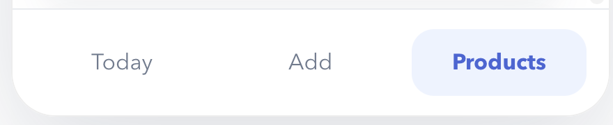
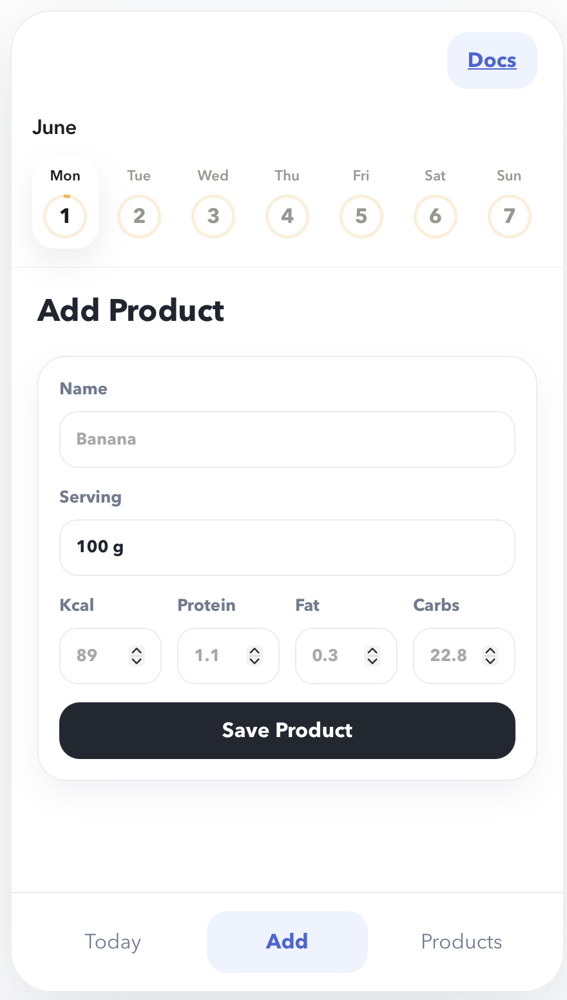
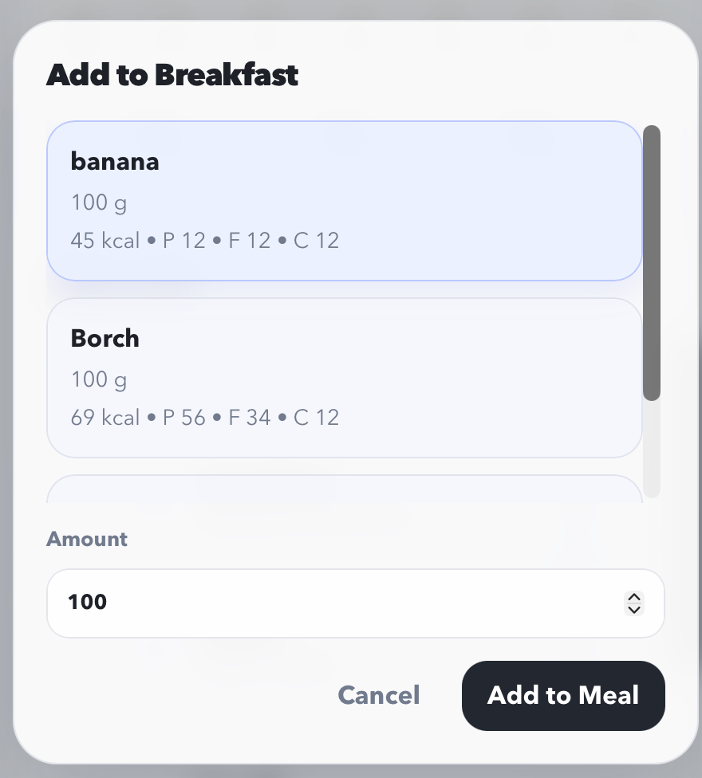
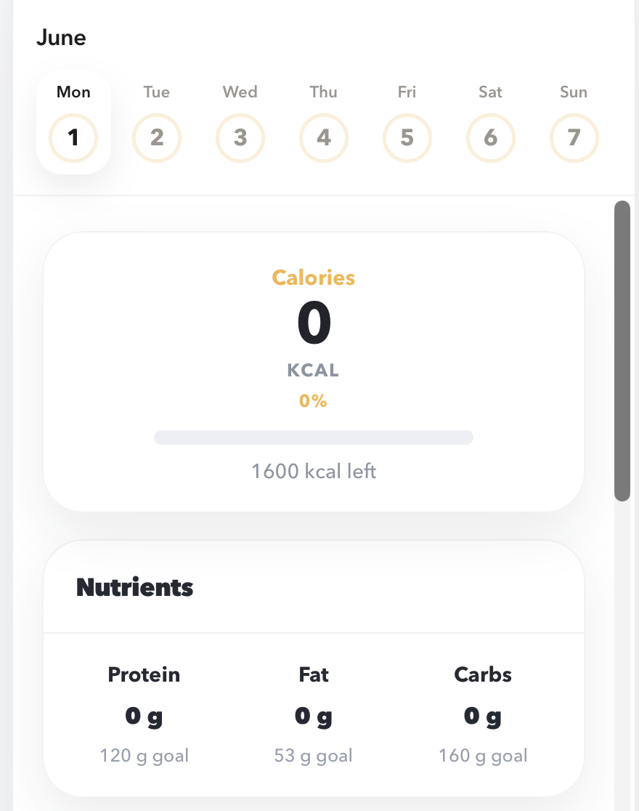
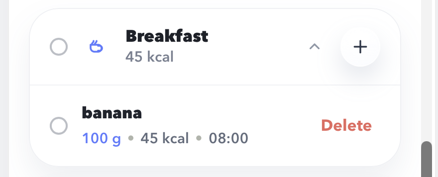
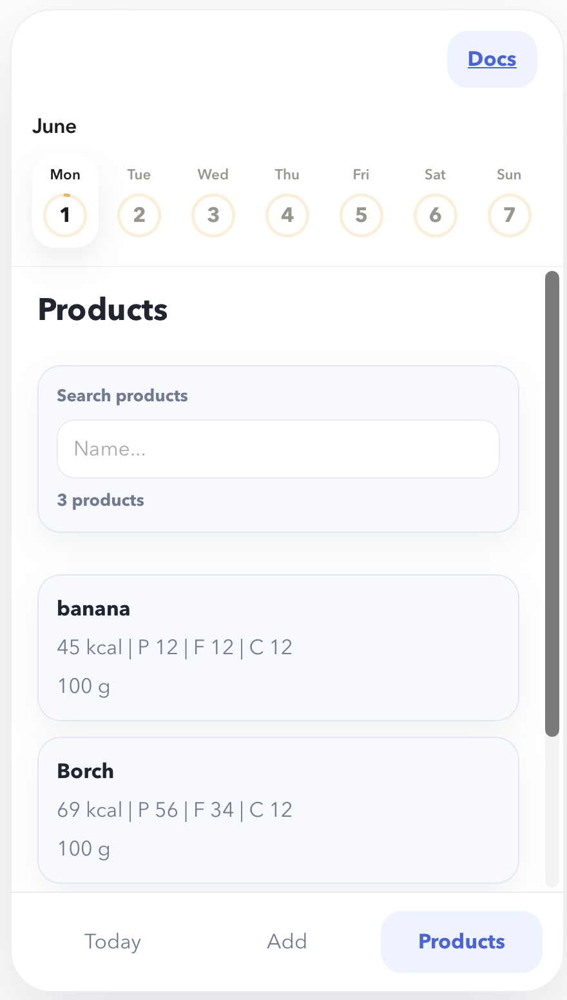

# User Guide

This guide follows the normal user workflow inside Nutrio.

## Main screens

| Screen | Purpose |
| --- | --- |
| `Today` | Review the selected day, add entries to meal sections, remove mistakes |
| `Add` | Create reusable food products |
| `Products` | Browse and search saved food products |

{ .app-shot .app-shot--wide }

## 1. Create a product

Before you can log meals, you need at least one saved product.

1. Open the `Add` screen.
2. Enter a product name.
3. Enter a serving label such as `100 g`.
4. Fill in `Kcal`, `Protein`, `Fat`, and `Carbs`.
5. Click `Save Product`.

{ .app-shot }

!!! note
    Nutrition values are stored as non-negative numbers. The default serving label is `100 g`.

## 2. Log food into a meal section

1. Open the `Today` screen.
2. Find the meal section where the entry belongs.
3. Click `+`.
4. Select a saved product.
5. Enter the amount in grams.
6. Submit the dialog.

The app creates a day entry, recalculates totals, and refreshes the summary automatically.

{ .app-shot }

## 3. Review daily progress

The summary card on top of the `Today` screen shows:

- consumed calories
- remaining calories
- daily progress in percent
- consumed protein, fat, and carbs
- target values for the tracked nutrients

Current built-in daily targets:

| Metric | Target |
| --- | --- |
| Calories | `1600 kcal` |
| Protein | `120 g` |
| Fat | `53 g` |
| Carbs | `160 g` |

{ .app-shot }

## 4. Use the calendar and meal groups

Nutrio groups entries by calendar day and shows them in these sections:

- Breakfast
- Snack
- Lunch
- Second Snack
- Dinner
- Third Snack

Use the calendar at the top of the app to switch between days and inspect previous totals.

## 5. Remove an incorrect entry

1. Open the correct day on the `Today` screen.
2. Find the meal card containing the wrong entry.
3. Click `Delete`.
4. Wait for the summary to refresh.

{ .app-shot }

## 6. Browse products

Open the `Products` screen to:

- inspect all saved products
- search by product name
- compare nutrition values quickly before logging a meal

{ .app-shot }
